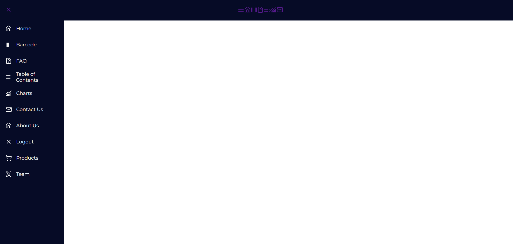

# react-side-nav-bar
## Description
A customizable and responsive side navigation bar for React applications, integrated with lucide-react icons. This component allows you to create a dynamic and stylish navigation menu that enhances user experience and improves navigation within your application.

Table of Contents
- [react-side-nav-bar](#react-side-nav-bar)
  - [Description](#description)
  - [Getting Started](#getting-started)
  - [Prerequisites](#prerequisites)
  - [Installation](#installation)
  - [Usage](#usage)
  - [Screenshots](#screenshots)
  - [Contributing](#contributing)
  - [Fork the repository.](#fork-the-repository)
  - [License](#license)

## Getting Started
This project was bootstrapped with Create React App.

## Prerequisites
Make sure you have Node.js installed. You can download it from here.

## Installation
Clone the repository:

bash

git clone https://github.com/your-username/react-side-nav-bar.git
Navigate to the project directory:

bash

cd react-side-nav-bar
Install the dependencies:

bash

npm install
Install lucide-react for icons:

bash

npm install lucide-react
Start the development server:

bash

npm start
This will run the app in the development mode. Open http://localhost:3000 to view it in the browser.

## Usage
Here’s a basic example of how to use the react-side-nav-bar component with lucide-react icons:

jsx

import React from 'react';
import SideNavBar from './SideNavBar';
import { Home, Info, Briefcase, Phone } from 'lucide-react';

const App = () => {
  return (
    

      <SideNavBar
        menuItems={[
          { name: 'Home', icon: <Home />, route: '/' },
          { name: 'About', icon: <Info />, route: '/about' },
          { name: 'Services', icon: <Briefcase />, route: '/services' },
          { name: 'Contact', icon: <Phone />, route: '/contact' },
        ]}
      />
      

        {/* Your main content goes here */}
      

    

  );
};

export default App;
Explanation:
Icons from lucide-react: Icons like Home, Info, Briefcase, and Phone are imported from lucide-react and used in the menuItems prop.
Props
Prop	Type	Description	Default
menuItems	Array	List of menu items, each with a name, icon, and route.	[]
width	String	Width of the side nav bar.	'250px'
position	String	Position of the side nav ('left' or 'right').	'left'
theme	String	Theme of the side nav ('light' or 'dark').	'light'
onSelect	Function	Callback function when a menu item is selected.	() => {}
Customization
You can easily customize the react-side-nav-bar to match your application's design. For example:

jsx

import { Settings, User } from 'lucide-react';

<SideNavBar
  menuItems={[
    { name: 'Dashboard', icon: <Home />, route: '/' },
    { name: 'Profile', icon: <User />, route: '/profile' },
    { name: 'Settings', icon: <Settings />, route: '/settings' },
  ]}
  width="300px"
  position="right"
  theme="dark"
  onSelect={(item) => console.log(`Selected ${item.name}`)}
/>

## Screenshots

## Contributing
Contributions are welcome! Please fork the repository and submit a pull request for any changes or improvements.

## Fork the repository.
Create a new branch (git checkout -b feature/YourFeature).
Make your changes.
Commit your changes (git commit -m 'Add some feature').
Push to the branch (git push origin feature/YourFeature).
Open a pull request.
## License
This project is licensed under the MIT License - see the LICENSE file for details.